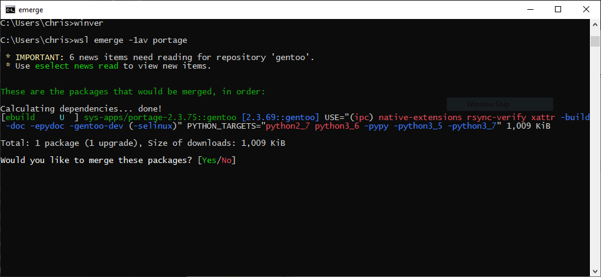

# gentoo-wsl2

## Requirements
- Windows 10 build 18917 or higher
- WSL
- Virual Machine Platform optional component
## Install
1. Follow the steps outlined [here](https://docs.microsoft.com/en-us/windows/wsl/wsl2-install)
2. from a terminal window run: `wsl --import <Distro> <InstallLocation> <FileName> --version 2`
  * `<Distro>` is replaced by what you want to call the distro (I've gone with Gentoo)
  * `<InstallLocation>` is the path you want to store the distro (I've stored mine in a folder in AppData\local)
  * `<FileName>` is the path to the tar file downloaded from the releases page
3. run `wsl -d <Distro>` where `<Distro>` is the name you gave it earlier
4. Continue the gentoo handbook to finalise your installation, you'll need to set custom CFLAGS/CXXFLAGS/MAKEOPTS (if needed), create a /mnt/gentoo/etc/portage/repos.conf/gentoo.conf and then continue from [Configuring Portage](https://wiki.gentoo.org/wiki/Handbook:AMD64/Installation/Base#Configuring_Portage), you won't need to set up a kernel, bootloader or init system
5. Have fun playing around

## Do it yourself
1. Install a WSL distro from the windows store (I went with debian)
2. Follow the steps outlined [here](https://wiki.gentoo.org/wiki/Replace_a_Linux_installation_with_Gentoo_in-place)
  * needed to run `apt-get update` before anything else
  * xz-utils was needed instead of bzip2
  * wget needed to be installed
  * **Unmount everything in /mnt before running the touch command to change the modification date**
  * fstab isn't needed
  * **Do not terminate or close the shell until the previously left behind files have been deleted**
  * Command to remove previous files is `find /bin /sbin /etc /lib /usr /var ! -newermt "1970-01-02" -print0 | xargs -0 rm -rf`
3. continue with step 4. above

